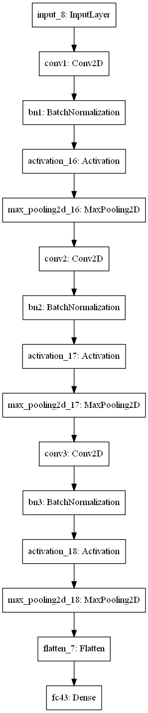

# TrafficSignClassification

Traffic sign classification project

## Dataset
A sample dataset was obtained from the following link: 
https://d17h27t6h515a5.cloudfront.net/topher/2016/November/581faac4_traffic-signs-data/traffic-signs-data.zip
They are image with a size of 32 x 32

## Model
A convolutional neural network was used to classify the traffic sign

The detailed setup can be found in the file: **tsc_model_seq.py**

Keras framework with tensorflow backend was used for the model building and training.
